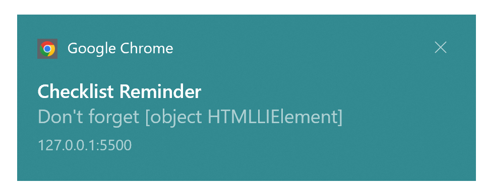

# Website Notification Feature

- When the Notification button is clicked the user will be prompted to grant Notification access

- User will then get a Notification that is created in script.js file

## Issues

I created a checklist to test if I can access an item in the checklist that will be displayed in the body of the notification.
Right now the body says " Don't forget null" When it should say "Don't forget Passport"


Here is the code for the notification text:
```bash

let list_item = document.getElementById("checklist-item1"); 

let notification = new Notification('Checklist Reminder', {
   
    body: `Don't forget ${list_item}`,
    icon: 'checklist.PNG',
    timestamp: dts
})
```

I get this notification when I click the Checklist button and then Home. 




